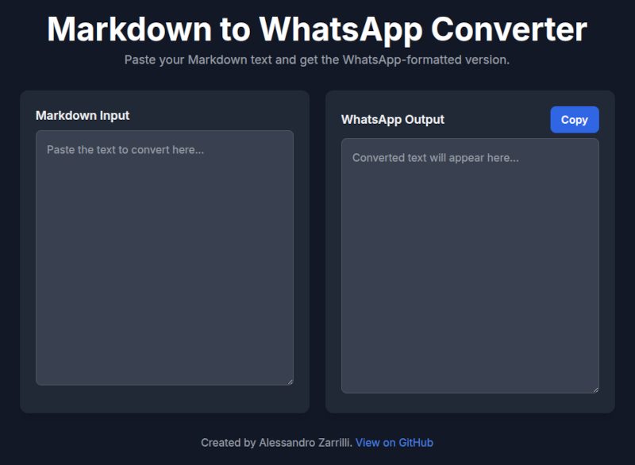

# Markdown to WhatsApp Converter

[](https://opensource.org/licenses/MIT)
[]()

A client-side web utility to convert standard Markdown into WhatsApp's formatting syntax.

**[➡️ Go to the Live Tool](https://drsound.github.io/markdown-to-whatsapp/)**



---

## Purpose of this Tool

WhatsApp uses a non-standard syntax for text formatting (e.g., `*bold*`, `_italic_`, `~strikethrough~`). This is similar, but not identical, to standard Markdown.

This tool provides a simple way to convert text from Markdown sources (like text editors, Google Docs, etc.) into the format that WhatsApp expects, saving the need for manual correction.

The entire conversion process runs locally in your browser using JavaScript. **No data is ever sent to a server.**

## Supported Conversions

The script handles the following Markdown syntax:

* **Text Styles:** Converts **bold**, _italic_, ~~strikethrough~~, and `monospace` code.
* **Headers:** Converts header lines (`# Title`) into bold text.
* **Lists:** Formats both ordered (`1. ...`) and unordered (`* ...`) lists, normalizing inconsistent spacing.
* **Links:** Transforms Markdown links (`[text](url)`) into a readable `text (url)` format.
* **Block Elements:** Preserves code blocks (```...```) and blockquotes (`> ...`).
* **Escape Characters:** Removes unnecessary backslash escape characters (`\`) from the output.

## How to Use

1.  **Open the web page:** [https://drsound.github.io/markdown-to-whatsapp/](https://drsound.github.io/markdown-to-whatsapp/)
2.  **Paste your text** into the left panel.
3.  **Copy the result** from the right panel using the "Copy" button.
4.  **Paste** the formatted text into your WhatsApp chat.